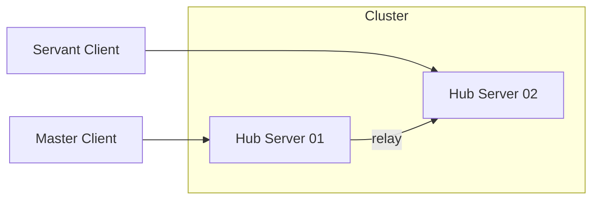

# Overview

A lightweight and secure debugging lib for remote process.

Features:

- Execute and attach to random CLI command on remote machine.
- Forward socks5 proxy on remote.
- Mount a remote directory to local with NFS.
- Uses the `golang.org/x/crypt/ssh` to establish secure connections.

Because Master and Servant uses public key to communicate, the Hub server can be a untrusted server.
